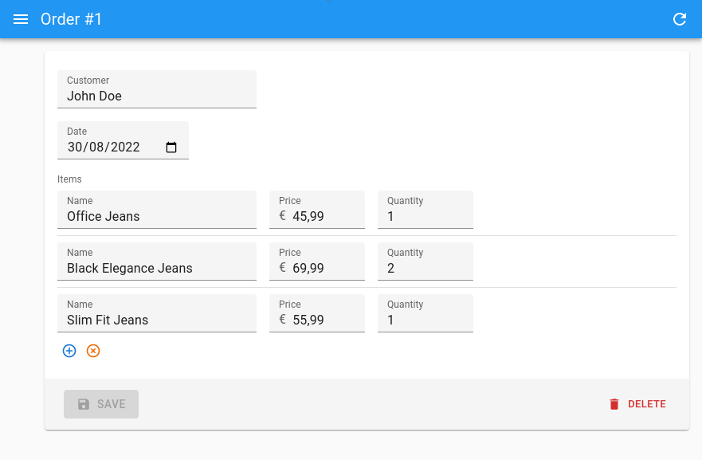

# `<ArrayInput>`

To edit arrays of data embedded inside a record, `<ArrayInput>` creates a list of sub-forms.



```jsx
import { ArrayInput, SimpleFormIterator, DateInput, TextInput } from 'react-admin';

<ArrayInput source="authors">
    <SimpleFormIterator>
        <DateInput source="user" />
        <TextInput source="role" />
    </SimpleFormIterator>
</ArrayInput>
```

`<ArrayInput>` allows editing of embedded arrays, like the `authors` field in the following `post` record:

```json
{
  "id": 123,
  "authors": [
        {
            "user_id": 123,
            "role": "head_writer",
        },
        {
            "user_id": 456,
            "url": "co_writer",
        }
   ]
}
```

## Usage

`<ArrayInput>` expects a single child, which must be a *form iterator* component. A form iterator is a component accepting a `fields` object as passed by [react-hook-form](https://react-hook-form.com/api/usefieldarray), and defining a layout for an array of fields. It also receives several functions to manipulate the array values. For instance, the `<SimpleFormIterator>` component displays an array of react-admin Inputs in an unordered list (`<ul>`), one sub-form by list item (`<li>`). It also provides controls for adding and removing a sub-record (a backlink in this example).

By using `<SimpleFormIterator inline>`, child inputs apper inline.

```jsx
import { ArrayInput, SimpleFormIterator, DateInput, TextInput } from 'react-admin';

<ArrayInput source="backlinks">
    <SimpleFormIterator inline>
        <DateInput source="date" />
        <TextInput source="url" />
    </SimpleFormIterator>
</ArrayInput>
```

You can pass `disableAdd`, `disableRemove` and `disableReordering` as props of `SimpleFormIterator`, to disable `ADD`, `REMOVE` and the `UP/DOWN` button(s) respectively. Default value of each is `false`.

```jsx
import { ArrayInput, SimpleFormIterator, DateInput, TextInput } from 'react-admin';

<ArrayInput source="backlinks">
    <SimpleFormIterator disableRemove>
        <DateInput source="date" />
        <TextInput source="url" />
    </SimpleFormIterator>
</ArrayInput>
```

You can also use `addButton`, `removeButton` and `reOrderButtons` props to pass your custom add, remove and reordering buttons to `SimpleFormIterator`.

```jsx
import { ArrayInput, SimpleFormIterator, DateInput, TextInput } from 'react-admin';

<ArrayInput source="backlinks">
    <SimpleFormIterator addButton={<CustomAddButton />} removeButton={<CustomRemoveButton />}>
        <DateInput source="date" />
        <TextInput source="url" />
    </SimpleFormIterator>
</ArrayInput>
```

Furthermore, if you want to customize the label displayed for each item, you can pass a function to `<SimpleFormIterator>` via the `getItemLabel` prop.

```jsx
import { ArrayInput, SimpleFormIterator, DateInput, TextInput } from 'react-admin';

<ArrayInput source="backlinks">
    <SimpleFormIterator getItemLabel={(index) => `${index + 1}. link`}>
        <DateInput source="date" />
        <TextInput source="url" />
    </SimpleFormIterator>
</ArrayInput>
```

**Note**: `<SimpleFormIterator>` only accepts `Input` components as children. If you want to use some `Fields` instead, you have to use a `<FormDataConsumer>` to get the correct source, as follows:

```jsx
import { ArrayInput, SimpleFormIterator, DateInput, TextInput, FormDataConsumer } from 'react-admin';

<ArrayInput source="backlinks">
    <SimpleFormIterator disableRemove >
        <DateInput source="date" />
        <FormDataConsumer>
            {({ getSource, scopedFormData }) => {
                return (
                    <TextField
                        source={getSource('url')}
                        record={scopedFormData}
                    />
                );
            }}
        </FormDataConsumer>
    </SimpleFormIterator>
</ArrayInput>
```

`<ArrayInput>` also accepts the [common input props](./Inputs.md#common-input-props) (except `format` and `parse`).

