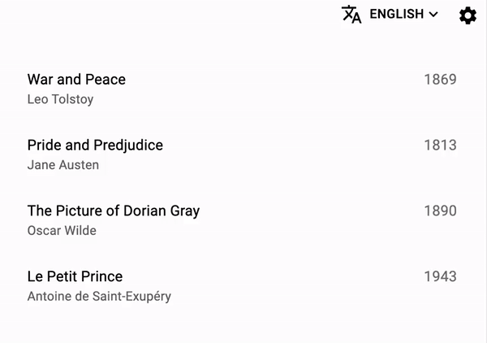

# `<Configurable>`

This component makes another component configurable by the end user. When they enter the configuration mode, users can customize the component's settings via the inspector.



Some react-admin components are already configurable - or rather they have a configurable counterpart:

- [`<SimpleListConfigurable>`](./SimpleList.md#configurable)

## Usage

Wrap any component with `<Configurable>` and define its editor to let users customize it via a UI. Don't forget to pass down props to the inner component. Note that every configurable component needs a unique preference key, that is used to persist the user's preferences in the Store.

```jsx
import { Configurable } from 'react-admin';

const ConfigurableTextBlock = ({ preferenceKey = "textBlock", ...props }) => (
    <Configurable editor={<TextBlockEditor />} preferenceKey={preferenceKey}>
        <TextBlock {...props} />
    </Configurable>
);
```

`<Configurable>` creates a context for the `preferenceKey`, so that both the child component and the editor can access it using `usePreferenceKey()`.
 
Then, use this component in your app:

```jsx
import { ConfigurableTextBlock } from './ConfigurableTextBlock';

export const Dashboard = () => (
    <ConfigurableTextBlock
        title="Welcome to the administration"
        content="Lorem ipsum dolor sit amet, consectetur adipiscing elit."
    />
);
```

## `children`

The wrapped component must use `usePreferenceKey` to get the preference key, and [`useStore`](./useStore.md) to access the configuration.

```jsx
import { useStore, usePreferenceKey } from 'react-admin';

const TextBlock = ({ title, content }) => {
    const preferenceKey = usePreferenceKey();
    const [color] = useStore(`${preferenceKey}.color`, '#ffffff');
    return (
        <Box bgcolor={color}>
            <Typography variant="h6">{title}</Typography>
            <Typography>{content}</Typography>
        </Box>
    );
};
```

## `editor`

The editor component must also use `usePreferenceKey` to get the preference key, and [`useStore`](./useStore.md) to read and write the configuration. When the user selects the configurable component, react-admin renders the `editor` component in the inspector.

```jsx
import { useStore, usePreferenceKey } from 'react-admin';

const TextBlockEditor = ({ preferenceKey }) => {
    const preferenceKey = usePreferenceKey();
    const [color, setColor] = useStore(`${preferenceKey}.color`, '#ffffff');
    return (
        <Box>
            <Typography>Configure the text block</Typography>
            <TextField
                label="Color"
                value={color}
                onChange={e => setColor(e.target.value)}
            />
        </Box>
    );
};
```

## `preferencesKey`

This parameter lets you specify the key used to store the configuration in the user's preferences. This allows you to have more than one configurable component of the same type per page. 

```jsx
import { Configurable } from 'react-admin';

const ConfigurableTextBlock = ({ preferencesKey, ...props }) => (
    <Configurable editor={<TextBlockInspector />} preferencesKey={preferencesKey}>
        <TextBlock {...props} />
    </Configurable>
);
```

Then in your application, set the `preferencesKey` prop to a unique value for each component:

```jsx
import { ConfigurableTextBlock } from './ConfigurableTextBlock';

export const Dashboard = () => (
    <>
        <ConfigurableTextBlock
            preferencesKey="textBlock1"
            title="Welcome to the administration"
            content="Lorem ipsum dolor sit amet, consectetur adipiscing elit."
        />
        <ConfigurableTextBlock
            preferencesKey="textBlock2"
            title="Security reminder"
            content="Nullam bibendum orci tortor, a posuere arcu sollicitudin ac"
        />
    </>
);
```

Users will be able to customize each component independently.

