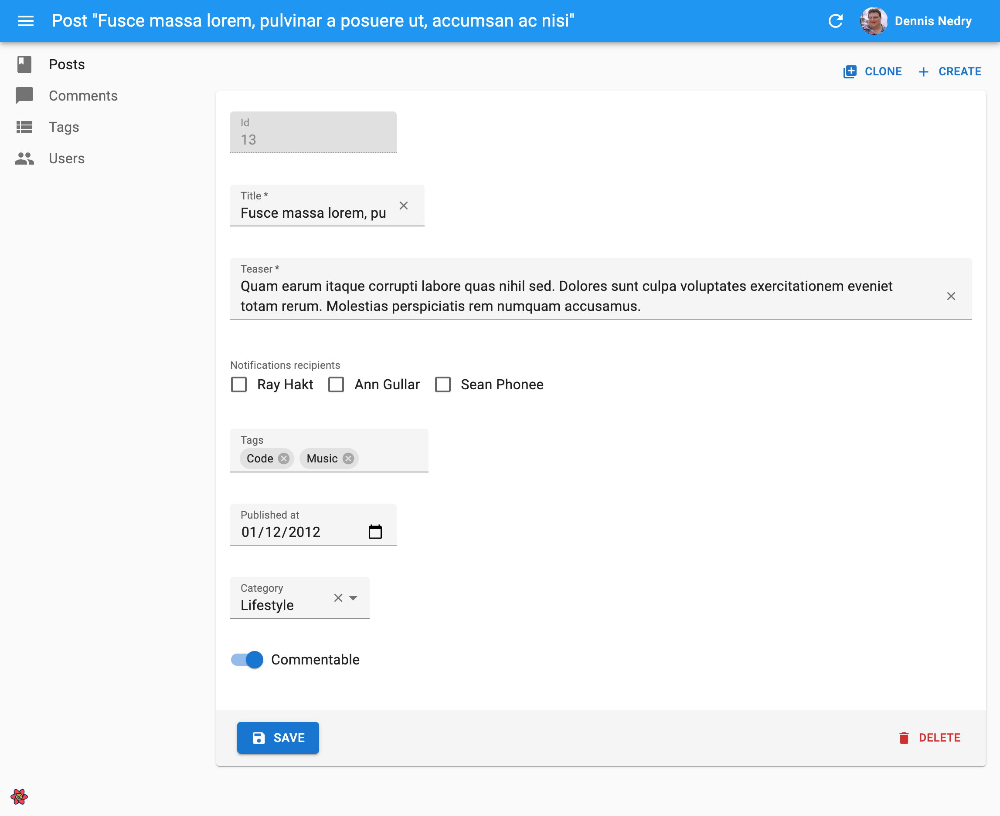

# The Create and Edit Views

Admin-on-REST provides `<Create>` and `<Edit>` components to create and edit records. The difference between these two components is that `<Edit>` fetches the API for a record, while `<Create>` starts with an empty object and doesn't fetch the API.

Just like the `<List>` component, they are only responsible for rendering the page layout ; they delegate the rendering to their children components - usually, [`<Input>`](./Inputs.html) components. They both render as a form.



Here are all the props accepted by the `<Create>` and `<Edit>` components:

* [`title`](#page-title)
* [`defautValue`](#default-values)
* [`validation`](#validation)

## Page Title

By default, the title for the Create view is "Create [resource_name]", and the title for the Edit view is "Edit [resource_name] #[record_id]".

You can customize this title by specifying a custom `title` prop:

```js
export const PostEdit = (props) => (
    <Edit title="Post edition" {...props}>
        ...
    </Edit>
);
```

More interestingly, you can pass a component as `title`. Admin-on-rest clone this component and, in the `<EditView>`, injects the current `record`. This allows to customize the title according to the current record:

```js
const PostTitle = ({ record }) => {
    return <span>Post {record ? `"${record.title}"` : ''}</span>;
};
export const PostEdit = (props) => (
    <Edit title={<PostTitle />} {...props}>
        ...
    </Edit>
);
```

## Default Values

To define default values, you can add a `defaultValue` prop to both form components (`<Edit>` and `<Create>`), or add a `defaultValue` from to individual input components.

### Global Default Value

The value of the form `defaultValue` prop must be an object, specifying default value for the created record. For instance:

```js
const postDefaultValue = { created_at: new Date(), nb_views: 0 };
export const PostCreate = (props) => (
    <Create {...props} defaultValue={postDefaultValue}>
        <TextInput source="title" />
        <RichTextInput source="body" />
        <NumberInput source="nb_views" />
    </Create>
);
```

**Tip**: You can include properties in the form `defaultValue` that are not listed as input components, like the `created_at` property in the previous example.

### Per Field Default Value

Alternatively, you can specify a `defaultValue` prop directly in `<Input>` components. Admin-on-rest will merge the child default values with the form default value (input > form):

```js
export const PostCreate = (props) => (
    <Create {...props}>
        <TextInput source="title" />
        <RichTextInput source="body" />
        <NumberInput source="nb_views" defaultValue={0} />
    </Create>
);
```

## Validation

To validate a form, you can add a `validation` prop to both form components (`<Edit>` and `<Create>`), to individual inputs, or even mix both approaches.

### Global Validation

The value of the form `validation` prop must be a function taking the record as input, and returning an object with error messages indexed by field. For instance:

``` js
const createValidation = (values) => {
    const errors = {};
    if (!values.firstName) {
        errors.firstName = ['The firstName is required'];
    }
    if (!values.age) {
        errors.age = ['The age is required'];
    } else if (values.age < 18) {
        errors.age = ['Must be over 18'];
    }
    return errors
};

export const UserCreate = (props) => (
    <Create {...props} validation={createValidation}>
        <TextInput label="First Name" source="firstName" />
        <TextInput label="Age" source="age" />
    </Create>
);
```

### Per Field Validation: Function Validator

Alternatively, you can specify a `validation` prop directly in `<Input>` components. Admin-on-rest will mash all the individual functions up to a single function looking just like the previous one:

```js
const firstNameValidation = (value, values) => {
    if (!value) {
        return ['The firstName is required'];
    }
    return [];
};

const ageValidation = (value, values) => {
    if (!value) {
        return ['The age is required'];
    }
    if (age < 18) {
        return ['Must be over 18'];
    }
    return [];
}

export const UserCreate = (props) => (
    <Create {...props}>
        <TextInput label="First Name" source="firstName" validation={firstNameValidation} />
        <TextInput label="Age" source="age" validation={ageValidation}/>
    </Create>
);
```

Input validation functions receive the current field value, and the values of all fields of the current record. This allows for complex validation scenarios (e.g. validate that two passwords are the same).

**Tip**: You can use *both* Form validation and input validation.

### Per Field Validation: Constraints Object

Validation constraints often look the same: asserting presence, size, format, etc. Instead of passing a function as validation, you can pass a constraints object:


```js
export const UserCreate = (props) => (
    <Create {...props}>
        <TextInput label="First Name" source="firstName" validation={{ required: true }} />
        <TextInput label="Age" source="age" validation={{ required: true, min: 18 }}/>
    </Create>
);
```


As Admin-on-rest translates these constraints objects to functions, the result is the same as before.

### Constraints Reference

You can use the following validation constraint names:

* `required` if the field is mandatory,
* `min` to specify a minimum value for integers,
* `max` to specify a maximum value for integers,
* `minLength` to specify a minimum length for strings,
* `maxLength` to specify a maximum length for strings,
* `email` to check that the input is a valid email address,
* `regex` to validate that the input matches a regex (must be an object with `pattern` and `message` keys),
* `choices` to validate that the input is within a given list,
* `custom` to use the function of your choice

## Buttons

If you need to link to the `<Edit>` or `<Create>` view, use the provided button components:
