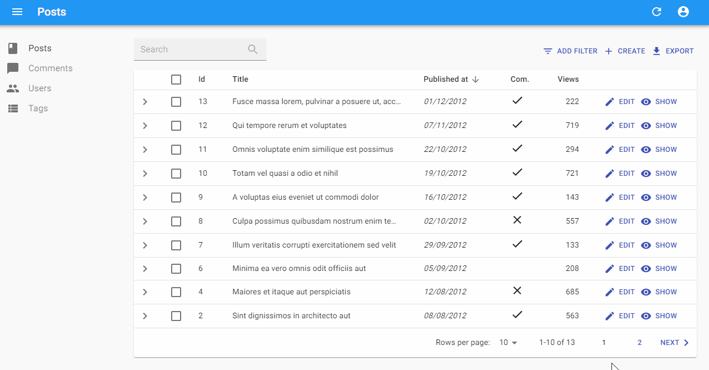

# `<FilterButton>`

Part of the filter button/form combo, `<FilterButton>` renders whenever you use the `<List filters>` prop. When clicked, it reveals a dropdown of filter names, allowing users to add a new filter input to the filter form.



It's an internal component that you should only need if you build a custom List layout. 

## Usage

`<FilterButton>` expects an array of filter inputs as `filters` prop:

```jsx
import { 
    CreateButton,
    Datagrid,
    FilterButton,
    FilterForm,
    ListBase,
    Pagination,
    TextField,
    TextInput,
} from 'react-admin';
import { Stack } from '@mui/material';

const postFilters = [
    <TextInput label="Search" source="q" alwaysOn />,
    <TextInput label="Title" source="title" defaultValue="Hello, World!" />,
];

const ListToolbar = () => (
    <Stack direction="row" justifyContent="space-between">
        <FilterForm filters={postFilters} />
        <div>
            <FilterButton filters={postFilters} />
            <CreateButton />
        </div>
    </Stack>
)

const PostList = () => (
    <ListBase>
        <ListToolbar />
        <Datagrid>
            <TextField source="id" />
            <TextField source="title" />
            <TextField source="body" />
        </Datagrid>
        <Pagination />
    </ListBase>
)
```

## `disableSaveQuery`


By default the filter button has a feature for you to be able to save a group of filters called `saved query` if you do not want to leave this feature active, you can add `disableSaveQuery` in filter button


```jsx
const ListToolbar = () => (
    <Stack direction="row" justifyContent="space-between">
        <FilterForm filters={postFilters} />
        <div>
            <FilterButton filters={postFilters} disableSaveQuery />
            <CreateButton />
        </div>
    </Stack>
)
```