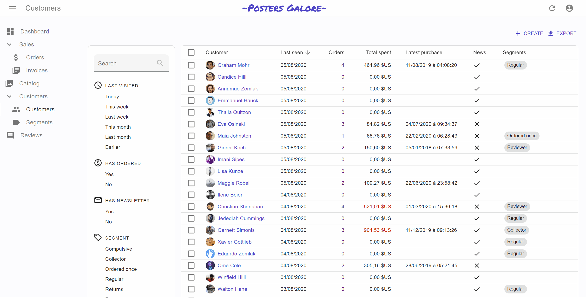
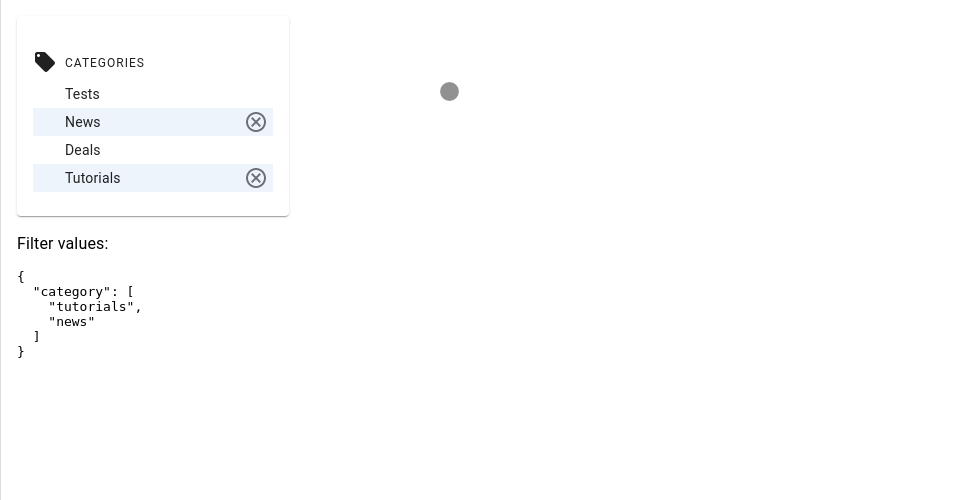

# `<FilterList>`

An alternative UI to the Filter Button/Form Combo is the FilterList Sidebar. Similar to what users usually see on e-commerce websites, it's a panel with many simple filters that can be enabled and combined using the mouse.



The user experience is better than the Button/Form Combo, because the filter values are explicit, and it doesn't require typing anything in a form. But it's a bit less powerful, as only filters with a finite set of values (or intervals) can be used in the `<FilterList>`.

## Usage

Use the `<FilterList>` component in a sidebar for the `<List>` view. It expects a list of `<FilterListItem>` as children. Each `<FilterListItem>` defines a filter `label` and a `value`, which is merged with the current filter value when enabled by the user. 

For instance, here is a filter sidebar for a post list, allowing users to filter on two fields:


```jsx
import { SavedQueriesList, FilterLiveSearch, FilterList, FilterListItem } from 'react-admin';
import { Card, CardContent } from '@mui/material';
import MailIcon from '@mui/icons-material/MailOutline';
import CategoryIcon from '@mui/icons-material/LocalOffer';

export const PostFilterSidebar = () => (
    <Card sx={{ order: -1, mr: 2, mt: 9, width: 200 }}>
        <CardContent>
            <SavedQueriesList />
            <FilterLiveSearch />
            <FilterList label="Subscribed to newsletter" icon={<MailIcon />}>
                <FilterListItem label="Yes" value={{ has_newsletter: true }} />
                <FilterListItem label="No" value={{ has_newsletter: false }} />
            </FilterList>
            <FilterList label="Category" icon={<CategoryIcon />}>
                <FilterListItem label="Tests" value={{ category: 'tests' }} />
                <FilterListItem label="News" value={{ category: 'news' }} />
                <FilterListItem label="Deals" value={{ category: 'deals' }} />
                <FilterListItem label="Tutorials" value={{ category: 'tutorials' }} />
            </FilterList>
        </CardContent>
    </Card>
);
```


Add this component to the list view using [the `<List aside>` prop](./List.md#aside-side-component):

```jsx
import { PostFilterSidebar } from './PostFilterSidebar';

export const PostList = () => (
    <List aside={<PostFilterSidebar />}>
        ...
    </List>
);
```

**Tip**: The `<Card sx>` prop in the `PostFilterSidebar` component above is here to put the sidebar on the left side of the screen, instead of the default right side.

A more sophisticated example is the filter sidebar for the visitors list visible in the screencast at the beginning of this page. The code for this example is available in the [react-admin repository](https://github.com/marmelab/react-admin/blob/master/examples/demo/src/visitors/VisitorListAside.tsx).

**Tip**: In a Filter List sidebar, you can use [the `<FilterLiveSearch>` component](./FilterLiveSearch.md) to add a search input at the top of the sidebar, and [the `<SavedQueriesList>` component](./SavedQueriesList.md) to add a list of saved queries.

`<FilterList>` accepts 3 props:

* [`children`](#children), which must be a list of `<FilterListItem>`
* [`icon`](#icon)
* [`label`](#label)

## `children`

The children of `<FilterList>` must be a list of `<FilterListItem>` components. Each `<FilterListItem>` defines a filter `label` and a `value`, which is merged with the current filter value when enabled by the user.


```jsx
import { FilterList, FilterListItem } from 'react-admin';

const HasNewsletterFilter = () => (
    <FilterList label="Has newsletter">
        <FilterListItem
            label="True"
            value={{ has_newsletter: true }}
        />
        <FilterListItem
            label="False"
            value={{ has_newsletter: false }}
        />
    </FilterList>
);
```


## `icon`

When set, the `<FilterList icon>` prop appears on the left side of the filter label.


```jsx
import { FilterList, FilterListItem } from 'react-admin';
import MonetizationOnIcon from '@mui/icons-material/MonetizationOnOutlined';

const HasOrderedFilter = () => (
    <FilterList
        label="Has ordered"
        icon={<MonetizationOnIcon />}
    >
        <FilterListItem
            label="True"
            value={{ nb_commands_gte: 1, nb_commands_lte: undefined }}
        />
        <FilterListItem
            label="False"
            value={{ nb_commands_gte: undefined, nb_commands_lte: 0 }}
        />
    </FilterList>
);
```


## `label`

React-admin renders the `<FilterList label>` on top of the child filter items. The string is passed through the `useTranslate` hook, and therefore can be translated.


```jsx
import { FilterList, FilterListItem } from 'react-admin';

const HasOrderedFilter = () => (
    <FilterList label="Has ordered">
        <FilterListItem
            label="True"
            value={{ nb_commands_gte: 1, nb_commands_lte: undefined }}
        />
        <FilterListItem
            label="False"
            value={{ nb_commands_gte: undefined, nb_commands_lte: 0 }}
        />
    </FilterList>
);
```


## Placing Filters In A Sidebar

You can place these `<FilterList>` anywhere inside a `<List>`. The most common case is to put them in a sidebar that is on the left-hand side of the `Datagrid`. You can use the `aside` property for that:


```jsx
import * as React from 'react';
import { Box, Card, CardContent, styled } from '@mui/material';

import { LastVisitedFilter, HasOrderedFilter, HasNewsletterFilter, SegmentFilter } from './filters';

const FilterSidebar = () => (
    <Box
        sx={{
            display: {
                xs: 'none',
                sm: 'block'
            },
            order: -1, // display on the left rather than on the right of the list
            width: '15em',
                marginRight: '1em',
        }}
    >
        <Card>
            <CardContent>
                <LastVisitedFilter />
                <HasOrderedFilter />
                <HasNewsletterFilter />
                <SegmentFilter />
            </CardContent>
        </Card>
    </Box>
);

const CustomerList = props => (
    <List aside={<FilterSidebar />}>
        // ...
    </List>
)
```


**Tip**: The `<FilterList>` Sidebar is not a good UI for small screens. You can choose to hide it on small screens (as in the previous example). A good tradeoff is to use `<FilterList>` on large screens, and the Filter Button/Form combo on Mobile.

## Customize How Filters Are Applied

Sometimes, you may want to customize how filters are applied. For instance, by allowing users to select multiple items such as selecting multiple categories. The `<FilterListItem>` component accepts two props for this purpose:

- `isSelected`: accepts a function that receives the item value and the currently applied filters. It must return a boolean.
- `toggleFilter`: accepts a function that receives the item value and the currently applied filters. It is called when user toggles a filter and must return the new filters to apply.

Here's how you could implement cumulative filters, e.g. allowing users to filter items having one of several categories:

```jsx
import { FilterList, FilterListItem } from 'react-admin';
import CategoryIcon from '@mui/icons-material/LocalOffer';

export const CategoriesFilter = () => {
    const isSelected = (value, filters) => {
        const category = filters.category || [];
        return category.includes(value.category);
    };

    const toggleFilter = (value, filters) => {
        const category = filters.category || [];
        return {
            ...filters,
            category: category.includes(value.category)
                // Remove the category if it was already present
                ? category.filter(v => v !== value.category)
                // Add the category if it wasn't already present
                : [...category, value.category],
        };
    };

    return (
        <FilterList label="Categories" icon={<CategoryIcon />}>
            <FilterListItem
                label="Tests"
                value={{ category: 'tests' }}
                isSelected={isSelected}
                toggleFilter={toggleFilter}
            />
            <FilterListItem
                label="News"
                value={{ category: 'news' }}
                isSelected={isSelected}
                toggleFilter={toggleFilter}
            />
            <FilterListItem
                label="Deals"
                value={{ category: 'deals' }}
                isSelected={isSelected}
                toggleFilter={toggleFilter}
            />
            <FilterListItem
                label="Tutorials"
                value={{ category: 'tutorials' }}
                isSelected={isSelected}
                toggleFilter={toggleFilter}
            />
        </FilterList>
    )
}
```


