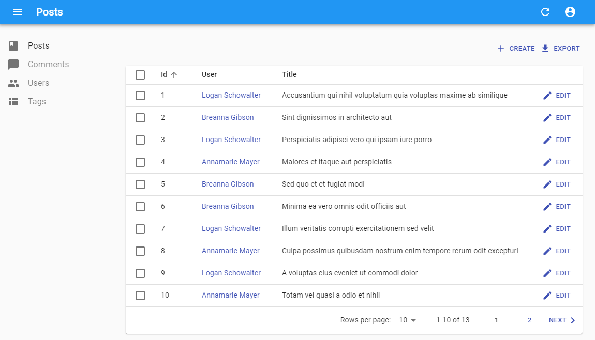

# `<ReferenceField>`

`<ReferenceField>` is useful for displaying many-to-one and one-to-one relationships. This component fetches a referenced record (using the `dataProvider.getMany()` method), and passes it to its child. A `<ReferenceField>` displays nothing on its own, it just fetches the data and expects its child to render it. Usual child components for `<ReferenceField>` are other `<Field>` components.

For instance, if a `post` has one author from the `users` resource, referenced by a `user_id` field, here is how to fetch the `user` related to each `post` record in a list, and display the `name` for each:

```jsx
import * as React from "react";
import { List, Datagrid, ReferenceField, TextField, EditButton } from 'react-admin';

export const PostList = () => (
    <List>
        <Datagrid>
            <TextField source="id" />
            <ReferenceField label="User" source="user_id" reference="users">
                <TextField source="name" />
            </ReferenceField>
            <TextField source="title" />
            <EditButton />
        </Datagrid>
    </List>
);
```

With this configuration, `<ReferenceField>` wraps the user's name in a link to the related user `<Edit>` page.



## Properties

| Prop        | Required | Type                | Default  | Description                                                                                                         |
| ----------- | -------- | ------------------- | -------- | ------------------------------------------------------------------------------------------------------------------- |
| `reference` | Required | `string`            | -        | The name of the resource for the referenced records, e.g. 'posts'                                                   |
| `children`  | Required | `Element`           | -        | The Field element used to render the referenced record                                                              |
| `link`      | Optional | `string | Function` | `edit`   | Target of the link wrapping the rendered child. Set to `false` to disable the link.                                 |
| `sortBy`    | Optional | `string | Function` | `source` | Name of the field to use for sorting when the user clicks on the column header.                                     |

`<ReferenceField>` also accepts the [common field props](./Fields.md#common-field-props).

## CSS API

| Rule name  | Description                   |
| ---------- | ----------------------------- |
| `link`     | Applied to each child element |

To override the style of all instances of `<ReferenceField>` using the [material-ui style overrides](https://material-ui.com/customization/globals/#css), use the `RaReferenceField` key.

## Usage

`<ReferenceField>` accepts a `reference` attribute, which specifies the resource to fetch for the related record.

**Note**: You **must** add a `<Resource>` for the reference resource - react-admin needs it to fetch the reference data. You *can* omit the `list` prop in this reference if you want to hide it in the sidebar menu.

```jsx
<Admin dataProvider={myDataProvider}>
    <Resource name="posts" list={PostList} />
    <Resource name="users" />
</Admin>
```

To change the link from the `<Edit>` page to the `<Show>` page, set the `link` prop to "show".

```jsx
<ReferenceField label="User" source="user_id" reference="users" link="show">
    <TextField source="name" />
</ReferenceField>
```

By default, `<ReferenceField>` is sorted by its `source`. To specify another attribute to sort by, set the `sortBy` prop to the according attribute's name.

```jsx
<ReferenceField label="User" source="user_id" reference="users" sortBy="user.name">
    <TextField source="name" />
</ReferenceField>
```

You can also prevent `<ReferenceField>` from adding a link to children by setting `link` to `false`.

```jsx
// No link
<ReferenceField label="User" source="user_id" reference="users" link={false}>
    <TextField source="name" />
</ReferenceField>
```

You can also use a custom `link` function to get a custom path for the children. This function must accept `record` and `reference` as arguments.

```jsx
// Custom path
<ReferenceField label="User" source="user_id" reference="users" link={(record, reference) => `/my/path/to/${reference}/${record.id}`}>
    <TextField source="name" />
</ReferenceField>
```

**Tip**: React-admin accumulates and deduplicates the ids of the referenced records to make *one* `dataProvider.getMany()` call for the entire list, instead of n `dataProvider.getOne()` calls. So for instance, if the API returns the following list of posts:

```js
[
    {
        id: 123,
        title: 'Totally agree',
        user_id: 789,
    },
    {
        id: 124,
        title: 'You are right my friend',
        user_id: 789
    },
    {
        id: 125,
        title: 'Not sure about this one',
        user_id: 735
    }
]
```

Then react-admin renders the `<PostList>` with a loader for the `<ReferenceField>`, fetches the API for the related users in one call (`GET http://path.to.my.api/users?ids=[789,735]`), and re-renders the list once the data arrives. This accelerates the rendering and minimizes network load.
