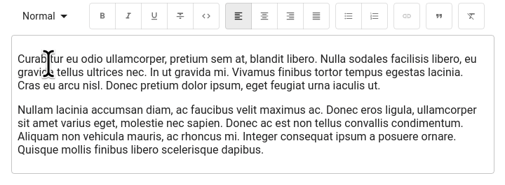

# `<RichTextInput>`

`<RichTextInput>` is the ideal component if you want to allow your users to edit some HTML contents. It is powered by [TipTap](https://www.tiptap.dev/).



**Note**: Due to its size, `<RichTextInput>` is not bundled by default with react-admin. You must install it first, using npm:

```sh
npm install ra-input-rich-text
# or
yarn add ra-input-rich-text
```

Use it as you would any react-admin inputs:

```jsx
import { Edit, SimpleForm, TextInput } from 'react-admin';
import { RichTextInput } from 'ra-input-rich-text';

export const PostEdit = (props) => (
	<Edit {...props}>
		<SimpleForm>
			<TextInput source="title" />
			<RichTextInput source="body" />
		</SimpleForm>
	</Edit>
);
```

## Customizing the Toolbar

The `<RichTextInput>` component has a `toolbar` prop that accepts a `ReactNode`.

You can leverage this to change the buttons [size](#api):

```jsx
import { Edit, SimpleForm, TextInput } from 'react-admin';
import { RichTextInput, RichTextInputToolbar } from 'ra-input-rich-text';

export const PostEdit = (props) => (
	<Edit {...props}>
		<SimpleForm>
			<TextInput source="title" />
			<RichTextInput source="body" toolbar={<RichTextInputToolbar size="large" />} />
		</SimpleForm>
	</Edit>
);
```

Or to remove some prebuilt components like the `<AlignmentButtons>`:

```jsx
import {
	RichTextInput,
	RichTextInputToolbar,
	LevelSelect,
	FormatButtons,
	ListButtons,
	LinkButtons,
	QuoteButtons,
	ClearButtons,
} from 'ra-input-rich-text';

const MyRichTextInput = ({ size, ...props }) => (
	<RichTextInput
		toolbar={
			<RichTextInputToolbar>
				<LevelSelect size={size} />
				<FormatButtons size={size} />
				<ListButtons size={size} />
				<LinkButtons size={size} />
				<QuoteButtons size={size} />
				<ClearButtons size={size} />
			</RichTextInputToolbar>
		}
		label="Body"
		source="body"
		{...props}
	/>
);
```

## Customizing the editor

You might want to add more Tiptap extensions. The `<RichTextInput>` component accepts an `editorOptions` prop which is the [object passed to Tiptap Editor](https://www.tiptap.dev/guide/configuration).

If you just want to **add** extensions, don't forget to include those needed by default for our implementation. Here's an example to add the [HorizontalRule node](https://www.tiptap.dev/api/nodes/horizontal-rule):

```jsx
import {
    DefaultEditorOptions,
    RichTextInput,
    RichTextInputToolbar,
    LevelSelect,
    FormatButtons,
    AlignmentButtons,
    ListButtons,
    LinkButtons,
    QuoteButtons,
    ClearButtons,
    useTipTapEdit,  
} from 'ra-input-rich-text';
import HorizontalRule from '@tiptap/extension-horizontal-rule';
import Remove from '@mui/icons-material/Remove';
import { ToggleButton } from '@mui/material';

const MyRichTextInputToolbar = ({ size, ...props }) => {
    const editor = useTipTapEdit();
  
    return (
        <RichTextInputToolbar {...props}>
            <LevelSelect size={size} />
            <FormatButtons size={size} />
            <AlignmentButtons size={size} />
            <ListButtons size={size} />
            <LinkButtons size={size} />
            <QuoteButtons size={size} />
            <ClearButtons size={size} />
            <ToggleButton
                aria-label="Add an horizontal rule"
                title="Add an horizontal rule"
                value="left"
                onClick={() =>
                    editor.chain().focus().setHorizontalRule().run()
                }
                selected={editor && editor.isActive('horizontalRule')}
            >
                <Remove fontSize="inherit" />
            </ToggleButton>
        </RichTextInputToolbar>
    );
}

const MyRichTextInput = ({ size, ...props }) => (
    <RichTextInput
        editorOptions={MyEditorOptions}
        toolbar={<MyRichTextInputToolbar size={size} />}
        label="Body"
        source="body"
        {...props}
    />
);

export const MyEditorOptions = {
	...DefaultEditorOptions,
	extensions: [
		...DefaultEditorOptions.extensions,
        HorizontalRule,
	],
};
```
