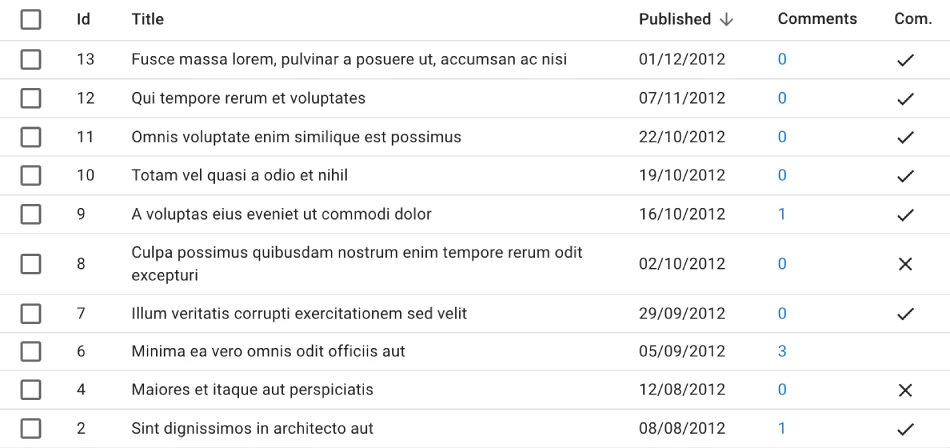
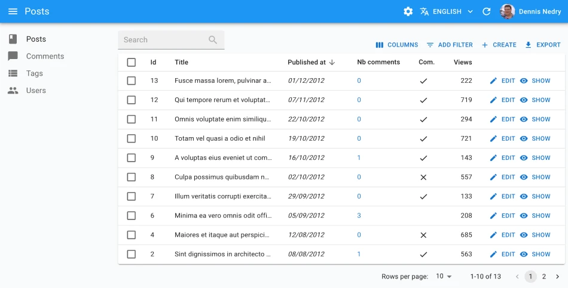

# Theming

React-admin applications use a neutral style by default. You will probably want to customize the look and feel to match your branding, or your end users preferences. Don't worry! You can customize the look and feel of pretty much everything in react-admin.

<video controls autoplay playsinline muted loop width="100%">
  <source src="https://user-images.githubusercontent.com/99944/116970434-4a926480-acb8-11eb-8ce2-0602c680e45e.mp4" type="video/webm" />
  Your browser does not support the video tag.
</video>

## Styling Individual Components

If you need to adjust the style of a single component, you can use [the `sx` prop](./SX.md). It works like React's `style` prop, but is much more powerful. It relies on a CSS-in-JS library bundled with Material UI.

The following example shows how to change the color, decoration, width, and font weight of a `<Datagrid>` column:

| Default style | Styled with `sx` | 
| --- | --- |
| [](./img/datagrid-sx-unstyled.webp) | [](./img/datagrid-sx-styled.webp) |


```jsx
import { Datagrid, TextField, List, DateField, ReferenceManyCount, BooleanField } from 'react-admin';

const PostList = () => (
    <List>
        <Datagrid
            sx={{
                '& .column-title': {
                    maxWidth: '16em',
                    overflow: 'hidden',
                    textOverflow: 'ellipsis',
                    whiteSpace: 'nowrap',
                },
                '& .column-commentable': {
                    maxWidth: '4em',
                },
            }}
        >
            <TextField source="id" sx={{ color: 'text.disabled' }} />
            <TextField source="title" />
            <DateField source="published_at" label="Published"/>
            <ReferenceManyCount
                label="Comments"
                reference="comments"
                target="post_id"
                link
                sx={{ color: 'inherit', fontWeight: 'bold' }}
            />
            <BooleanField
                source="commentable"
                label="Com."
                sortable={false}
                sx={{ '& .RaBooleanField-falseIcon': { visibility: 'hidden' } }}
            />
    </List>
);
```


The `sx` prop supports all the CSS features you need to style your components, including media queries, pseudo-classes, nesting, and more. Check the [dedicated `sx` chapter](./SX.md) for more information.

## App-Wide Theming

If you need to customize the look and feel of the whole application, you can use the `theme` prop of the `<Admin>` component. It accepts a theme object, which is a plain JavaScript object with a specific structure. You can either create your own theme object, or extend the default theme object provided by react-admin.

| Default style | Styled with `theme` | 
| --- | --- |
| [](./img/datagrid-theme-unstyled.webp) | [](./img/datagrid-theme-styled.webp) |

```jsx
import { Admin, defaultTheme } from 'react-admin';
import indigo from '@mui/material/colors/indigo';
import pink from '@mui/material/colors/pink';
import red from '@mui/material/colors/red';

const myTheme = {
    ...defaultTheme,
    palette: {
        mode: 'dark',
        primary: indigo,
        secondary: pink,
        error: red,
    },
    typography: {
        // Use the system font instead of the default Roboto font.
        fontFamily: [
            '-apple-system',
            'BlinkMacSystemFont',
            '"Segoe UI"',
            'Arial',
            'sans-serif',
        ].join(','),
    },
    components: {
        ...defaultTheme.components,
        MuiTextField: {
            defaultProps: {
                variant: 'outlined' as const,
            },
        },
        MuiFormControl: {
            defaultProps: {
                variant: 'outlined' as const,
            },
        },
    },
};

const App = () => (
    <Admin theme={theme}>
        // ...
    </Admin>
);
```

The application theme lets you customize color, typography, spacing, and component defaults. Check the [dedicated Application Theme chapter](./AppTheme.md) for more information.

## Customizing The Page Layout

React-admin provides alternative layout components. For instance, you can replace the default `<Layout>`, which uses a sidebar for navigation, with a [`<ContainerLayout>`](./ContainerLayout.md), which uses a top bar instead.


```jsx
import { Admin, Resource } from 'react-admin';
import { ContainerLayout } from '@react-admin/ra-navigation';

export const App = () => (
    <Admin dataProvider={dataProvider} layout={ContainerLayout}>
        <Resource name="songs" list={SongList} />
        <Resource name="artists" list={ArtistList} />
    </Admin>
);
```

You can even write your own layout component from scratch. Check the [dedicated Layout chapter](./Layout.md) for more information.

## Customizing Page Elements

Here is a list of the most common UI elements you may want to customize, and the props you can use to do so:

| UI Element | Prop |
| --- | --- |
| AppBar Content | [`<Layout appBar>`](./Layout.md#appbar) |
| Menu (on the left) | [`<Layout menu>`](./Layout.md#menu) |
| User Menu (on the top right) | [`<AppBar userMenu>`](./AppBar.md#usermenu) |
| Sidebar | [`<Layout sidebar>`](./Layout.md#sidebar) |
| Login page | [`<Admin loginPage>`](./Authentication.md#customizing-the-login-component) |
| Logout button | [`<AppBar userMenu>`](./AppBar.md#usermenu) |
| Notification snackbar | [`<Admin notification>`](./Admin.md#notification) |
| Error page | [`<Layout error>`](./Layout.md#error) |

## Material-Ui Components For Theming

Material-ui is a rich UI library, so you may not know all its components. There are 3 components you should know about when theming react-admin:

- `<Box>`: a generic container component, which can be used to add padding, margin, and background color to any component. It is used extensively in react-admin, and you will probably use it a lot too.
- `<Stack>`: a component to stack elements vertically or horizontally. 
- `<Grid>`: a component to display elements in a grid. 


We've summarized the most important props of these components in a dedicated documentation: [`<Box>`, `<Stack>` and `<Grid>`](./BoxStackGrid.md). You should definitely read it.