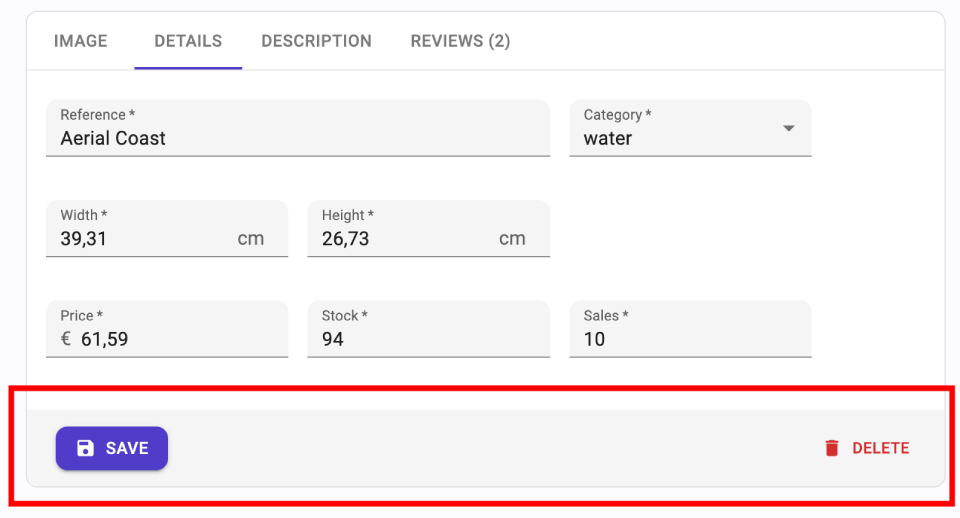

# `<Toolbar>`

`<Toolbar>` is the component react-admin renders at the bottom of `<SimpleForm>` and `<TabbedForm>`. By default, it renders a `<SaveButton>` and, on edition pages, a `<DeleteButton>`. On mobile, it is fixed at the bottom of the screen.



**Tip**: Use react-admin's `<Toolbar>` component instead of MUI's `<Toolbar>` component. The former builds upon the latter and adds support for an alternative mobile layout (and is therefore responsive).

## Usage

Create a custom toolbar using `<Toolbar>`, then inject it to `<SimpleForm>` or `<TabbedForm>` using the `toolbar` prop: 

```jsx
// in src/MyToolbar.jss
import { Toolbar } from 'react-admin';

export const MyToolbar = () => <Toolbar />;

// in src/CommentCreate.jsx
import { Create, SimpleForm, DateInput, TextInput } from 'react-admin';
import { MyToolbar } from './MyToolbar';

const CommentCreate = () => (
    <Create>
        <SimpleForm toolbar={<MyToolbar />}>
            <TextInput source="author.name" />
            <DateInput source="created_at" />
            <TextInput source="body" />
        </SimpleForm>
    </Create>
);
```

`<Toolbar>` accepts the following props:

- [`children`](#children)
- `className`
- [`sx`](#sx-css-api)

Additional props are passed down to [the MUI `<Toolbar>` component](https://mui.com/api/toolbar/).

## `children`

When rendered without children, `<Toolbar>` renders a `<SaveButton>` and, on edition page, a `<DeleteButton>`. Create a toolbar with children to customize the buttons displayed, or the options of the buttons. 

For instance, to display two save buttons in a creation form, one to save and redirect to the edition page, and the second to save and empty the form:


```jsx
import { Toolbar, SaveButton, useRedirect, useNotify } from 'react-admin';
import { useFormContext } from 'react-hook-form';

const MyToolbar = () => {
    const { reset } = useFormContext();
    const notify = useNotify();
    return (
        <Toolbar>
            <SaveButton label="Save" />
            <SaveButton 
                label="Save and add"
                mutationOptions={{
                    onSuccess: () => {
                        notify('Element created');
                        reset();
                    }}
                }
                type="button"
                variant="text"
            />
        </Toolbar>
    );
};
```


## `sx`: CSS API

You can override the style of the toolbar using the `sx` prop. Use the class names of the inner commponents to tweak their styles:

| Rule name                      | Description                                                                            |
|--------------------------------|----------------------------------------------------------------------------------------|
| `&.RaToolbar-desktopToolbar`   | Applied to the underlying `MuiToolbar` component for medium and large screens          |
| `&.RaToolbar-mobileToolbar`    | Applied to the underlying `MuiToolbar` component for small screens                     |
| `& .RaToolbar-defaultToolbar`  | Applied to the internal wrapper of the `<Toolbar>` buttons when no children are passed |

To override the style of all instances of `<Toolbar>` components using the [MUI style overrides](https://mui.com/customization/globals/#css), use the `RaToolbar` key.
